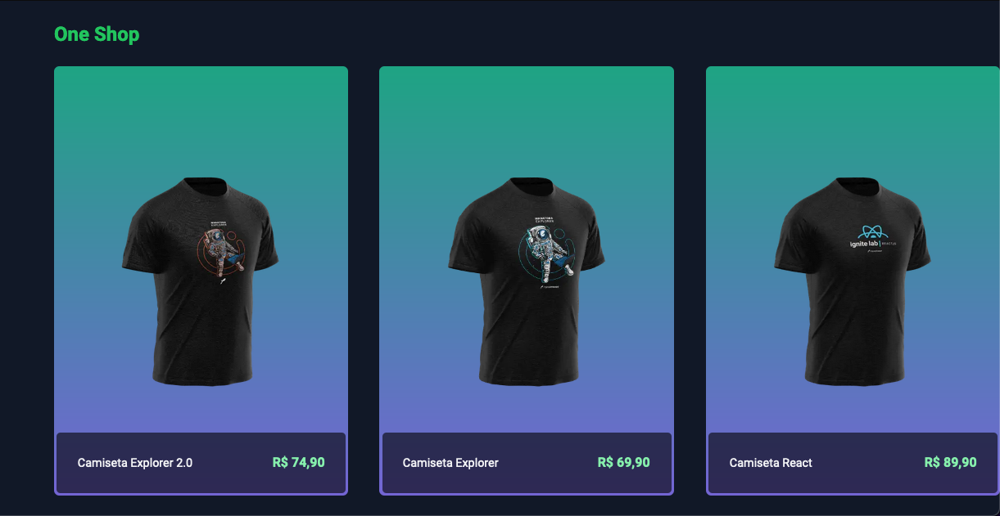
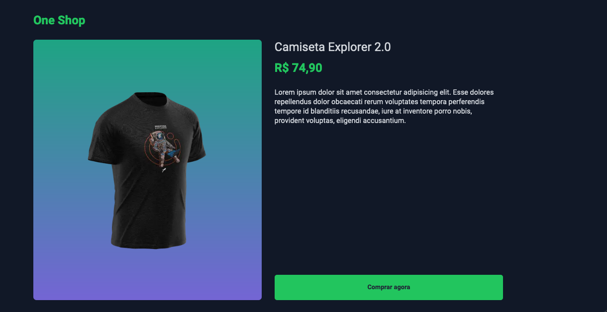
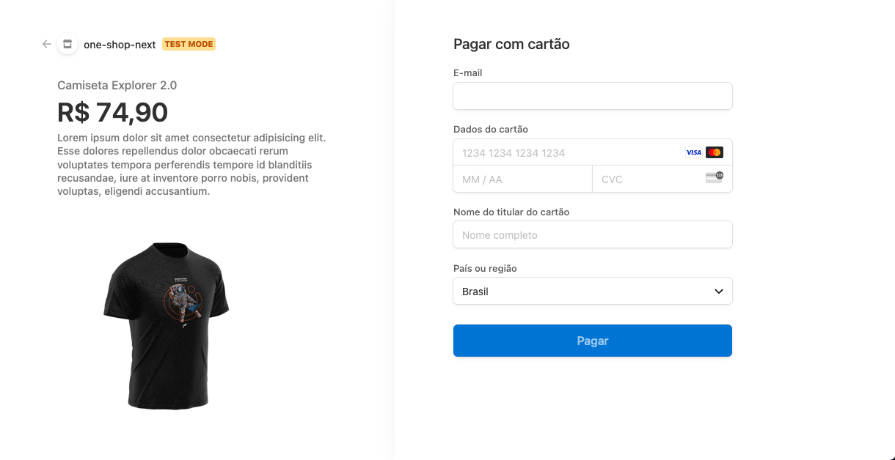
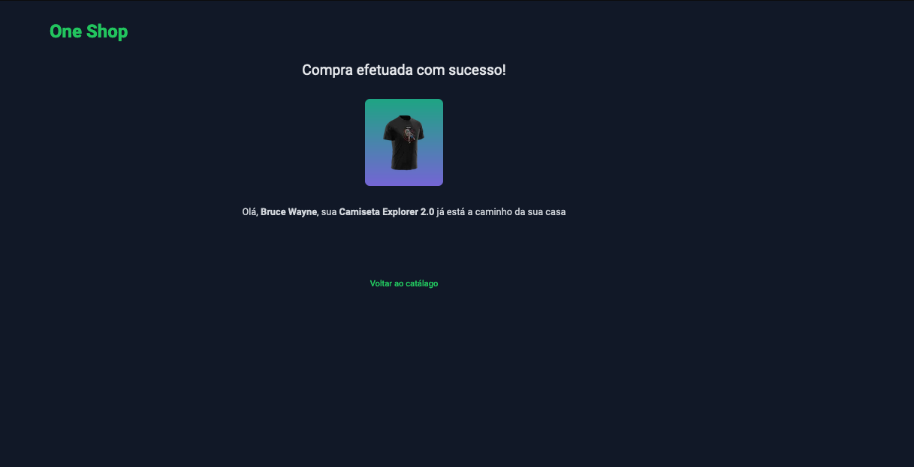

<h1 align="center">
  One shop Next
</h1>

## Uma loja virtual simples, onde pode escolher o item e pagar usando os serviços do stripe

**Tecnologias:**

- [ReactJS](https://pt-br.reactjs.org)
- [Typescript](https://www.typescriptlang.org)
- [Tailwindcss](https://tailwindcss.com)-
- [Stripe](https://stripe.com/br)

**Demonstração:**

<p align="center">
  
  
  
  
</p>

**Instalação e Execução:**

1.  Clone o repositório:

Bash

```
git clone https://github.com/Gui-dev/one-shop-next.git

```

2.  Clone o repositório:

Bash

```
pnpm install

```

3.  Execute a aplicação web:

Bash

```
npm run dev
```

```
pnpm dev
```

5.  Acesse a aplicação em http://localhost:3000 no seu navegador.

**Contribuição:**

Agradecemos a sua contribuição para este projeto! Você pode contribuir submetendo issues e pull requests no repositório GitHub.

**Licença:**

Este projeto está licenciado sob a licença MIT.
